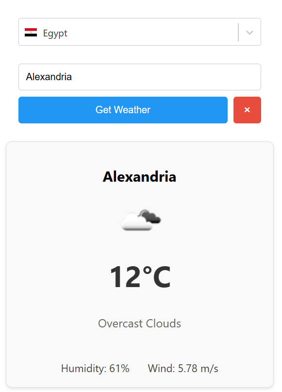

# Weather Application

A simple application that displays weather conditions in Egyptian cities. In the screenshot above you can see:
- Temperature: 12°C
- Weather Condition: Overcast Clouds
- Humidity: 61%
- Wind Speed: 5.78 m/s
